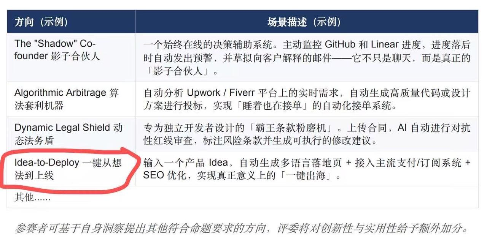
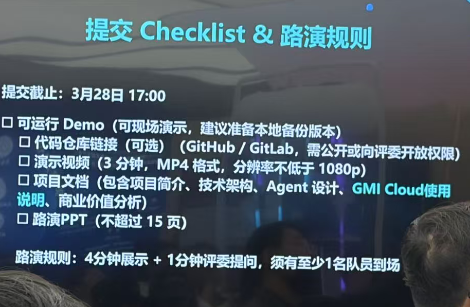
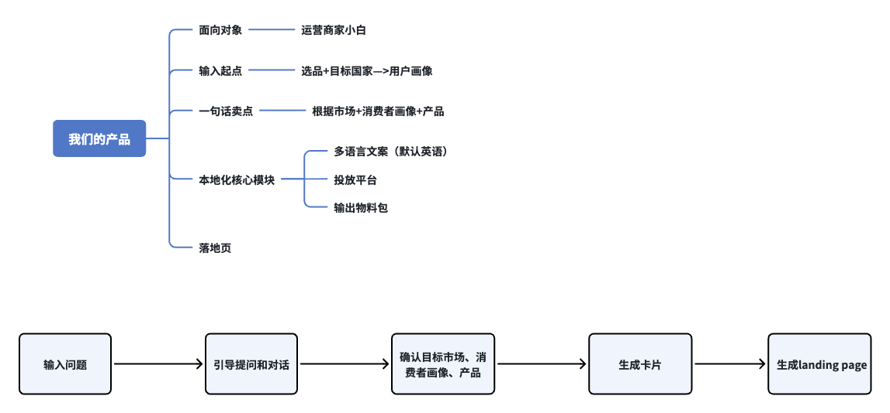

# 出海赛道方向：Idea-to-Deploy

## 一句话定义

“We don’t help you build your product.
&#x20;We help you win your first 100 users.”

***

# 定位：

* 帮助个人卖家/中小初创的把一句产品想法，变成一个能拿去海外市场的首发**落地包**

* 帮第一次出海的人，把最容易卡住的首发动作一次打包完成

* **面向谁**：独立开发者 / 小团队 / AI 创业者 / 数字产品卖家

* **卡在哪**：不会定位、不会写英文首发页、不会定价、不会准备 launch assets&#x20;

* **解决什么**：**一次生成首发所需的关键资产**

# 市场背景：

## 一句 idea → 出海首发验证 MVP growth stack 现有的两种方法

### 1. 用一体化工具 + 少量补充

* &#x20;Landing page：Webflow / Framer / Typedream&#x20;

* &#x20;文案+多语言：ChatGPT + DeepL&#x20;

* &#x20;SEO：Semrush / Ahrefs&#x20;

* &#x20;收款：Stripe + Gumroad&#x20;

* &#x20;冷启动：Apollo + Twitter / Reddit&#x20;

特点：**极快上线，但上限一般**

### 2. **增长型模块化 stack**

* &#x20;内容生成 → AI agent&#x20;

* &#x20;分发 → 多渠道&#x20;

* &#x20;数据 → CRM归因&#x20;

# 参考系（需要补齐竞品地图）：

> 国内相邻产品至少已经分成几层了
>
> 1. Agent/应用搭建层有 Dify、扣子、腾讯元器这类平台，主打工作流、智能体、零代码或低代码应用开发
>
> 2. 出海建站/经营层有店匠这类平台，提供独立站、支付、营销等一体化能力
>
> 3. 更往企业任务自动化走的还有阿里国际刚发布的 Accio Work。
>
> 它们都不是我们要做的东西本身，但都在抢相邻心智。

## **Accio Work**

* 阿里国际推出的面向中小企业的 agentic AI 平台，主打“开箱即用”的企业任务自动化，重点落在生意经营、电商运营、选品、采购、营销等高价值业务流程上，并且强调权限控制与安全

* \=》我们的差异点：增长导向，而不是工具导向

## Partnerly

https://partnerly.us/how-gtm-works

* GTM系统构建服务，帮出海公司搭建一个完整的获客系统

* **市场 → 内容 → 分发 → 转化**串成一个系统

* \= 我们要做的方案的偏B端高配版本

* Partnerly问题：

  * 太重、需要人、需要时间、偏B2B、SaaS

  * 不适合：个人卖家 / 小团队

* \=》我们的机会点：轻量版 GTM OS

## 落地页产品对比表

# 推进计划

## 第一阶段：竞品深调

### 回答3个问题：

1. 谁已经在解决相似问题

2. 他们解决到哪一层

3. 他们没解决什么

[AI 首发上线助手竞品研究简报](https://ycn3htymf440.feishu.cn/docx/V5sadVwAjoFhzLx4vICcdC24njg?from=from_copylink)

## 第二阶段：明确交付框架

### 3.26 线下讨论

### 1. 以提交Checklist倒推

* 可运行Demo&#x20;

* 代码仓库链接（可选是否开源）——上传到Charlie Github

* 项目文档（包含项目简介、技术架构、Agent设计、GMI Cloud使用说明、商业价值分析）

* 路演PPT（不超过15页）+演示视频（3分钟）——@Elina

### 2. 产品定位

重点在【落地】，不再是【验证】

### 3. 架构

#### 1. Idea → Market Definition（输入模块-chatbox形式）

输入一句想法，通过对话明确用户产品【选品】+市场信息

此阶段需要明确的信息包括：

* **target market**（国家）&#x20;

  * 北美/东南亚/欧洲等，demo展示到我们有这些市场的选项，但是仅做到北美GTM策略匹配知识库（Reddit）

  * Pull vs Push：直接推市场

* **target audience**（消费者画像）&#x20;

  * Push：系统根据上文主动匹配产品在特定市场中对应的消费者群体&#x20;

* **product positioning**（一句话卖点——爆点推荐）&#x20;

输入一句话 → 经过几轮对话→ 输出一个“出海定位卡片”

#### 2. Localization Engine（本地化核心模块）

包含：

* **多语言文案（EN / ES / JP…）**

  * *Demo显示有多种语言可选，但是只做到英语即可&#x20;*

* **投放社交平台的选择（INS/TK/Youtube/Reddit/Facebook etc）**

  * *依然Demo呈现有这些选择，但是以INS为例*

* **tone适配（对应语言市场对应平台的native表达）&#x20;**

* **cultural adaptation（文化适配）&#x20;**

📌 Demo展示方式：

同一产品 → 美国版 landing plan（ vs 日本版 对比）

***

#### 3. 两个视图的落地页

##### 对内页：GTM Workspace（可参考Paternly GTM方案页面）

这是给使用产品的商家自己看的，属性是：

* &#x20;面向操作者&#x20;

* &#x20;展示 launch plan

* 发布后的数据看板

包括：

* &#x20;GTM plan&#x20;

* &#x20;发布前 checklist

* &#x20;首发渠道建议&#x20;

* &#x20;对应渠道的发布物料

* 发布后的优化建议——有一个看板

  * &#x20;SEO关键词建议&#x20;

  * 定价/促销建议

  * 内容发布后的播放数据/转评赞

📌 Demo展示方式：

一键生成可展示的网页（静态HTML）

##### 对外页：Landing Page Preview / Publish（独立站页面）

这是给用户的顾客看的独立站页面：

* 发布前：可预览、调整设计（编辑模式：有个对话框，支持自然语言修改设计）

* &#x20;一键发布后——demo可以只展示到静态的成品HTML，时间够套一个可完成到支付环节的网站模板

  * 包含品牌banner

  * 商品页

  * Q\&A

📌 Demo展示方式：

可网页（静态HTML），可完整包含上架商品的独立站

### 线上框架对齐

* 工作流

###

